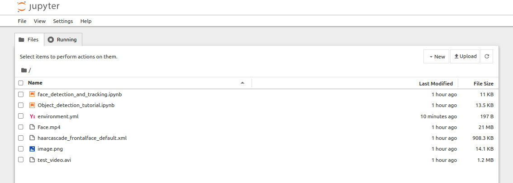
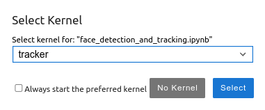

## Exercise 4 (TG.ROBO-400 Mechatronics and Programming - 2024)

This repository contains work that was build upon the original [ros_gz](https://github.com/gazebosim/ros_gz/tree/humble) repository by Open robotics.


### Pre-requisites

This package is tested on the following configurations
- Ubuntu 22.04
- Python 3.10
- ROS2 Humble 

---
### TASK 1: Build the ROS2 Package

The ros2 package hosted in this repository launches an ignition gazebo simulation of a walking actor and a camera sensor. The camera is pointed
towards the walking actor and it captures the complete motion within its field of view.

1.1 To build the package open a terminal and run the commands below.

```
$ mkdir -p ~/ws/src
$ cd ~/ws/src
$ git clone https://github.com/KulunuOS/AUT.700-E4.git . -b humble
$ cd ~/ws
$ source /opt/ros/humble/setup.bash
$ colcon build

```


1.2 Run the simulation

```
$ cd ~/ws
$ source install/setup.bash
$ ros2 launch walking_actor cam_world.launch.py
```
At this point if you have done everything correctly the ros package should launch and display as below. Press **cntrl + c** to kill the simulation. 


---
### Task 2: Install Miniconda and setup python environment.


 We will be using miniconda to setup the python environment. Miniconda is a light version of anaconda. Follow the [official installation guide](https://docs.anaconda.com/miniconda/#quick-command-line-install) for troubleshooting. But you are free to use either of the two options. If you have an existing installation you can skip and start from 2.2

2.1 Install miniconda 

open a new terminal and run the commands below

```
$ mkdir -p ~/miniconda3
$ wget https://repo.anaconda.com/miniconda/Miniconda3-latest-Linux-x86_64.sh -O ~/miniconda3/miniconda.sh
$ bash ~/miniconda3/miniconda.sh -b -u -p ~/miniconda3
$ rm ~/miniconda3/miniconda.sh
$ export PATH=~/miniconda3/bin:$PATH
$ source ~/.bashrc

```
close the terminal and open a new terminal and run the 2 commands below

```
$ source /opt/ros/humble/setup.bash
$ conda init
$ conda activate
```
if the installation is successful, the terminal must enter the conda base environment as below. 

```
$ (base)username:~$ 
```

2.2 Create python environment

we create a conda evironment to install the python libraries required for this exercise. As you can understand now, conda helps to mitigate dependency issues when developing multiple sofware packages in the same operating system. Before, proceeding familiarize yourself with [managing conda environments](https://docs.conda.io/projects/conda/en/latest/user-guide/tasks/manage-environments.html#creating-an-environment-from-an-environment-yml-file)

enter the following commands in the same terminal as in task 2.1 

```
$ cd ~/ws/src/Notebooks
$ conda env create -f environment.yml
$ conda activate tracker
```

2.3 Install Jupyter notebook and link conda environment to jupyter kernel

[Jupyter notebooks](https://docs.jupyter.org/en/latest/index.html) are an interactive way of explaining code. in the same terminal, run the commands below to complete the rest of the setup.

```
$ conda install jupyter
$ ipython kernel install --user --name=tracker
```

---
### Task 3: Object Detection and Tracking

In this task, you will be implementing an object detection and tracking algorithms with opencv. OpenCV is an opensource python library which is widely used in computer vision tasks. Aim of this exercise is to learn the fundamentals of using computer vision with ROS2 echosystem.


The task is presented in an interactive notebook. Open the jupyter notebook following the commands below. you can continue in the same terminal as task 2.3

```
$ cd ~/ws/src/Notebooks
$ jupyter-notebook
```
Jupyter notebook will launch in a browser tab as in the image below. double click and open the _object_detection_tutorial.ipynb_ file



Remember to set the kernel of the notebook to *tracker* environment you created previouly. you can also manually set it from the menu bar (_kernel->change_kernel_)



Follow the notebook instructions and fill in the gaps to complete each subtask.

---
### Task 4: Object Detection and Tracking

In this exercise you will implement a face detection algorithm using OpenCV. 

- *Viola-Jones detection algorithm* is used to find a face in an image
- The *Kanade-Lucas-Tomasi (KLT) algorithm* is a feature tracker, which first detects a set of feature points and then tracks these using optical flow.

Open _face_detection_and_tracking.ipynb_ in the same way as in task 3. Switch the kernel to “tracker” and follow as instructed in the notebook

---
### Task 5: Bonus tasks

5.1 use input from webcam for face detection

Implement the above face detection and tracking on yours or your friend’s faces using an input from a webcam/usbcam and ROS framework.

5.2 Improve Face detection in task 4:

The face detector might detect a face in a place where no face is actual present or lose its track halfway the video. In the worst case, the point tracker tracks stationary points somewhere in background. This means that the tracker never “releases” the points, and the actual face is left unnoticed. To prevent this, one way is to perform a new face detection regularly (e.g. every 100 frames). Try to Implement this periodic face detection and improve tracking.