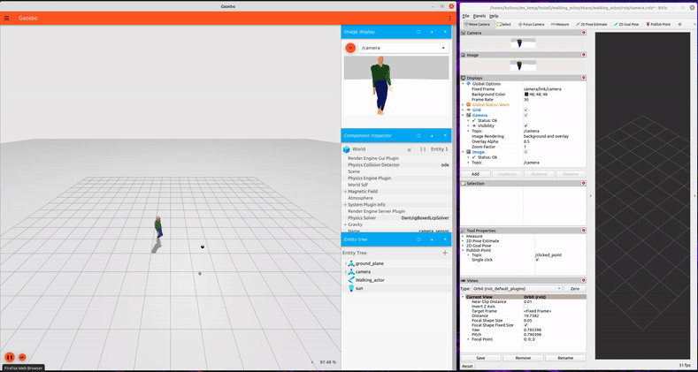

# AUT.700-E4
This repository contains work that was build upon the original [ros_gz](https://github.com/gazebosim/ros_gz/tree/foxy) repository by Open robotics.




### Pre-requisites

This package is tested on the following configurations
- Python 3.8.8
- ROS2 Foxy 

### Installation 

To build the package open a fresh terminal and run the commands below

```
$ mkdir -p ~/ws/src
$ cd ~/ws/src
$ git clone https://github.com/KulunuOS/AUT.700-E4.git . -b foxy
$ cd ~/ws
$ source /opt/ros/foxy/setup.bash
$ colcon build

```
### Run the simulation
 
Run the commands below to launch the simulation 

```
$ cd ~/ws
$ source install/setup.bash
$ ros2 launch walking_actor cam_world.launch.py
```